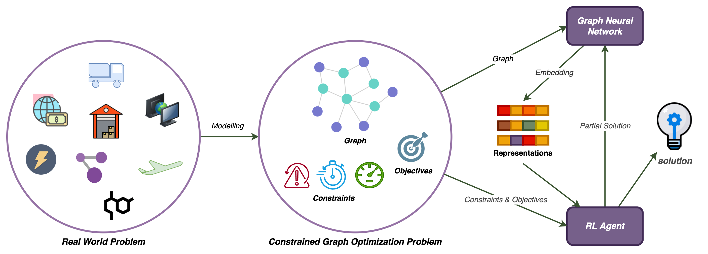

Hello!

    I'm a PhD student in Management Science & Engineering at Stanford, working with [Prof. Madeleine Udell](https://people.orie.cornell.edu/mru8/). Previously, I completed a master's degree in Computer Science at University of Toronto and did my undergrad in Computer Engineering at Sharif University of Technology.

<h2>My Research Interests</h2>
 
    I use Machine Learning to tackle Constrained Optimization problems. Currently, I'm working on methods that leverage Graph Neural Networks (GNNs) and Reinforcement Learning (RL) to solve Constrained Optimization problems on graphs.

<h3> That was a bunch of fancy terms. What does it mean exactly? </h3>

    Graph-structured data is abundant around us, and we've been modeling and solving real-world problems with graphs for decades. We've already developed optimal and fast solutions to a subset of these problems. However, some others are too hard, complicated, or time-consuming to solve using explicit mathematical and algorithmic methods ([NP Problems](https://www.britannica.com/science/NP-complete-problem) are a good example).

    Neural networks are good at extracting complicated patterns from high-dimensional data. We can use GNNs to embed the graphical information into numerical representations, feed those to an RL model, and ask the model to generate a solution by maximizing/minimizing an objective of interest. 

<h3>It sounds cool! But is it actually useful?</h3>

    This approach is scalable and can result in close to optimal results. It, however, is not fully interpretable and lacks optimality guarantees. These characteristics make it a perfect fit for a subgroup of graph optimization problems, but not for all of them. Proper modeling of the input information, expressive architecture design, and problem-specific constraint enforcement are some of the challenges of this approach. Making all of the modules work together can also be tricky.

    Some examples of real-world applications are:
* Supply Chain Management
* Grid Optimization
* Social Media Marketing
* Circuit Design
* Network Optimization 
    

<h3>I want to maximize/minimize something on a graph. Can we talk?</h3>

    Of course! Feel free to shoot me an email at [teshnizi@stanford.edu](mailto:teshnizi@stanford.edu). I'd also love to chat about anything else that you find related and interesting!

